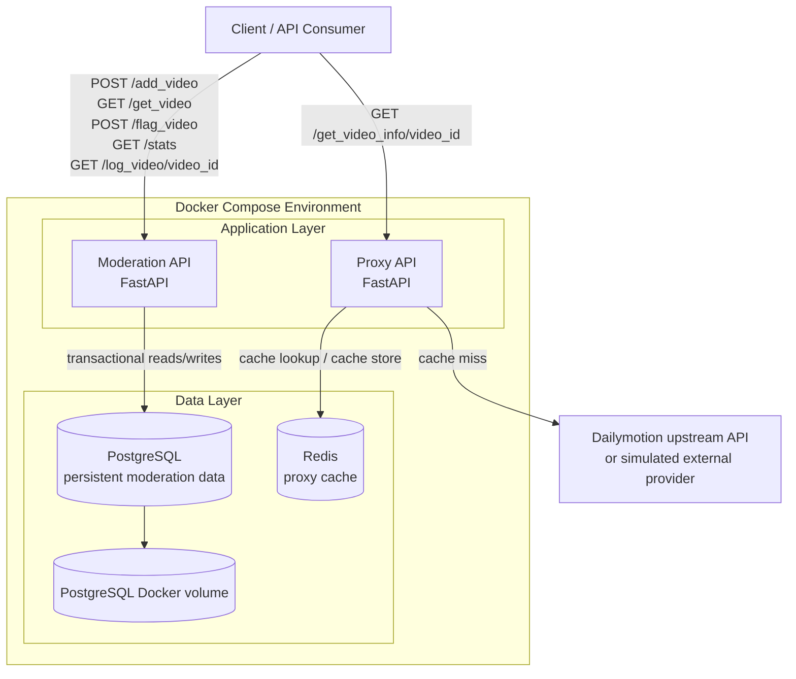

# Architecture

## Overview

This project is built as two independent backend services orchestrated with Docker Compose. The **Moderation API** is the core service of the system: it manages the moderation queue, moderator assignment, moderation decisions, statistics, and audit logs. Its state is persisted in **PostgreSQL**, which guarantees durability across container restarts through a dedicated Docker volume. The **Proxy API** exposes video information through a dedicated endpoint and uses **Redis** as a caching layer to avoid unnecessary repeated upstream calls. Both services are isolated in their own containers, which makes the project reproducible, easy to run locally, and compliant with the requirement that reviewers should only need Docker and Docker Compose to run the application and its tests.

## Architecture schema

## Technical choices

- **Python**
  - Chosen for fast development, readability, and strong ecosystem support for backend services and testing.

- **FastAPI**
  - Used to build both HTTP services.
  - Provides clear route definitions, request/response validation, and automatic API documentation.
  - Well suited for small and medium backend services with explicit business logic.

- **PostgreSQL**
  - Used as the persistent database for the moderation domain.
  - Stores videos, moderation state, assignments, and moderation logs.
  - Supports transactional operations, which is important for FIFO queue handling and concurrent moderator access.
  - Preferred because SQLite is explicitly forbidden by the specification.

- **Redis**
  - Used only by the Proxy API as a cache layer.
  - Reduces repeated calls for the same video information.
  - Simple and efficient fit for key-value caching with TTL-based expiration.

- **SQLAlchemy Core**
  - Chosen instead of an ORM to respect the “no ORM” constraint.
  - Allows explicit SQL-oriented data access while still keeping query construction and connection handling structured.
  - Good fit for concurrency-sensitive and transaction-heavy logic.

- **pytest**
  - Used for automated testing.
  - Suitable for unit and integration testing of both services.
  - Easy to run inside containers, which keeps the test workflow aligned with the delivery requirements.

- **Docker Compose**
  - Used to orchestrate the full local environment: APIs, PostgreSQL, Redis, and persistence volume.
  - Ensures the project can be started and tested without requiring local installation of Python, PostgreSQL, or Redis.
  - Matches the delivery constraint that reviewers should only need Docker / Docker Compose.

## Responsibilities by component

- **Moderation API**
  - Add a video to the moderation queue
  - Retrieve the next video to moderate
  - Keep moderator/video assignment consistent
  - Flag a video as spam or not spam
  - Expose moderation statistics
  - Expose the moderation history of a video

- **Proxy API**
  - Expose video information through a dedicated endpoint
  - Cache upstream responses in Redis
  - Return consistent responses for repeated requests

- **PostgreSQL**
  - Persistent source of truth for moderation data

- **Redis**
  - Volatile cache for proxy responses

- **Docker Compose**
  - Reproducible execution environment for runtime and tests

## Design principles

- **Separation of concerns**
  - Moderation workflow and video information proxying are handled by two distinct services.

- **Persistence where required**
  - Moderation state must survive restarts, so it is stored in PostgreSQL.

- **Cache where useful**
  - Video information is cacheable, so Redis is used only for the proxy side.

- **Explicit data access**
  - SQL is kept explicit to preserve control over transactions and concurrency-sensitive operations.

- **Container-first delivery**
  - The project is designed to run entirely through Docker Compose to simplify evaluation and reproduction.
